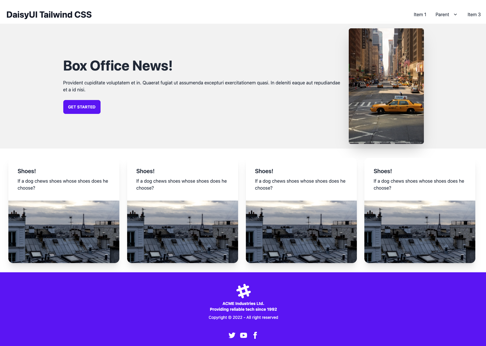
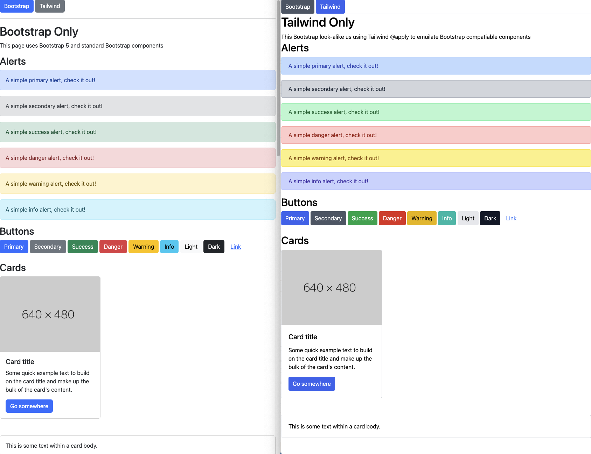
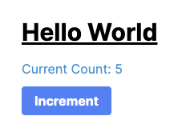
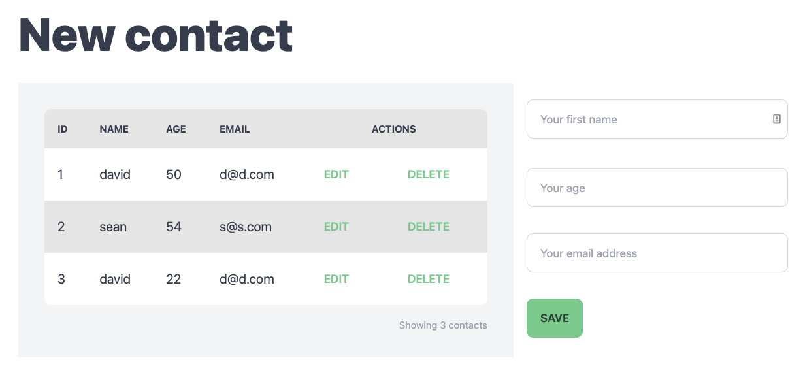
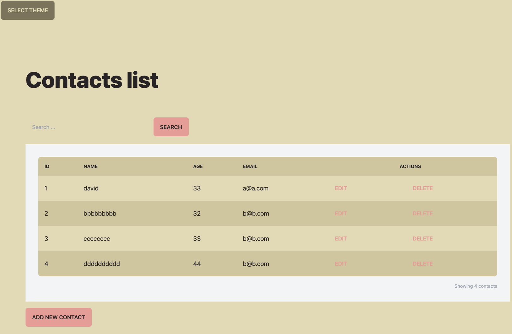

# After Templates

A set of templates that can be used via the `--template` argument

## Videos

- profile: rag-tailwind
  - Demonstrates a Tailwind homepage
  - setup tailwind using --css=tailwind option

  

- profile: rag-tailwind-daisyui
  - Tailwind, DaisyUI and Theme Changer using Stimulus
  - Make sure it persists the theme change across pages

  

- profile: rag-tailwind-emulating-bootstrap
  - Bootstrap & Tailwind in same application plus Bootstrap Emulation
  - Demonstrates running bootstrap and tailwind in the same Rails 7 application
  - Demonstrates using Bootstrap CSS classes in a Tailwind project

  

- profile: rag-tailwind-hotwire
  - Simple hotwire driven counter

  

- profile: rag-tailwind-form
  - Hotwire driven form using Tailwind and DaisyUI

  

- profile: rag-tailwind-form-search
  - Hotwire driven form and live search on Tailwind, with theme selector

  

- Hotwire Flash Messages
- Tailwind, Reusing Styles
  - https://tailwindcss.com/docs/reusing-styles